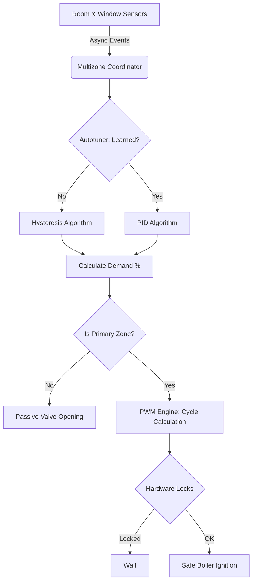

# Multizone Thermostat — Home Assistant Custom Integration (V3)

A custom integration for Home Assistant that provides **multi-zone heating management** with **centralized boiler control** and **advanced PID autotuning**. No YAML scripting or manual automations required — everything is configured through the Home Assistant UI.

## 🌟 What makes this unique?

1. **Dynamic Autotuning (Hysteresis → Silent PID)**: Starts in Hysteresis mode, studies the room's thermal dispersion over time, and seamlessly transitions to a precise PID controller without user intervention to eliminate temperature swings.
2. **Hierarchical Zones (Primary vs Secondary)**: Primary zones can trigger the boiler. Secondary zones only passively open valves to "steal" heat when the boiler is already running, saving gas.
3. **TRV Sensor Override**: The Multizone Coordinator intercepts TRVs attached to hot radiators and injects mathematical offsets or fake targets to force the TRV to obey the true room temperature provided by a clean, external Zigbee sensor.
4. **100% Async Event-Driven**: Zero polling loops. The code only wakes up on state changes, ensuring near-zero CPU footprint on your Home Assistant server.
5. **Zero-Code Auto Dashboard**: Automatically generates a stunning, premium, fully responsive climate dashboard with our custom cards.

## Features

- 🖥️ **100% UI Config Flow** — Setup wizard: select your boiler relay and add zones directly from the HA interface
- 🔘 **Master Switch** — One switch to enable/disable the entire heating system
- 🏠 **Zone Modes (Primary/Secondary/Bypass)** — Advanced per-zone control. 
- 📍 **Geofencing & Auto-Sleep** — Automatically switch to Away or Sleep presets based on home occupancy (presence sensors).
- 🔥 **Automatic Boiler Control** — Boiler turns ON when any Primary zone is heating, OFF when all zones are idle
- 🛡️ **Boiler & Valve Protection** — Native `number` entities for anti-short-cycle, valve opening delay, and **Summer Anti-seize protection**
- 🪟 **Window Sensor Detection** — Automatically bypass zones when a window is opened, and restore them when closed
- 🌡️ **Virtual Thermostats** — Create virtual thermostat entities directly from the UI by combining a temperature sensor and a heater switch
- 🌤️ **Weather Compensation** — Dynamic "Feed-Forward" heating adjustment based on an outdoor physical or meteorological sensor
- 🧠 **Multi-TRV Aggregation** — Group multiple TRVs in the same room. The system automatically calculates their average temperature and syncs their targets.
- 📉 **Dynamic Heat Demand (%)** — Calculates the exact percentage of heating load required by the house in real-time.
- 🔄 **Global Presets & Dynamic Memory** — Manual, Eco, Comfort, Sleep, Away. The system remembers the specific temperature and bypass state of *each zone* per preset.
- 🎨 **4 Custom Lovelace Cards** — Master status card, circular dial card, compact button card, and global preset card — all auto-registered

## 🏗️ System Architecture

## Installation

### Via HACS (recommended)

1. Open HACS in your Home Assistant instance.
2. Click the three dots in the top right corner and select **Custom repositories**.
3. Add `https://github.com/alex-military/multizone-thermostat` as an **Integration**.
4. Search for **"Multizone Thermostat"** in HACS and click **Download**
5. Restart Home Assistant

### Manual
1. Copy the `custom_components/multizone_thermostat` folder to your HA `custom_components` directory
2. Restart Home Assistant

## Documentation Hub

Everything about the Multizone Thermostat is documented in the following dedicated pages:

- ⚙️ **[Configuration & Setup Guide](configuration.md)**: Learn how to configure the integration, set up Virtual Thermostats, understand the internal logic, and use features like Geofencing and Summer Anti-seize.
- 🎨 **[Lovelace Custom Cards & Dashboard](cards.md)**: Explore the included custom cards, how to use them, and how to enable the **Zero-Code Auto Dashboard Strategy**.
- 🚀 **[Project Roadmap](ROADMAP.md)**: View completed phases (System Safety, PID, UI) and our future plans (Cooling, Predictive AI, Energy Optimization).

## Acknowledgments

A special thanks to the creators of [SmartThermostat](https://github.com/ScratMan/HASmartThermostat) and [vindaalex/multizone-thermostat](https://github.com/vindaalex/multizone-thermostat). The core mathematical logic for the PID controller and the Autotuning algorithm in this project were deeply inspired by and adapted from their fantastic open-source work.

## License

This project is licensed under the MIT License.
