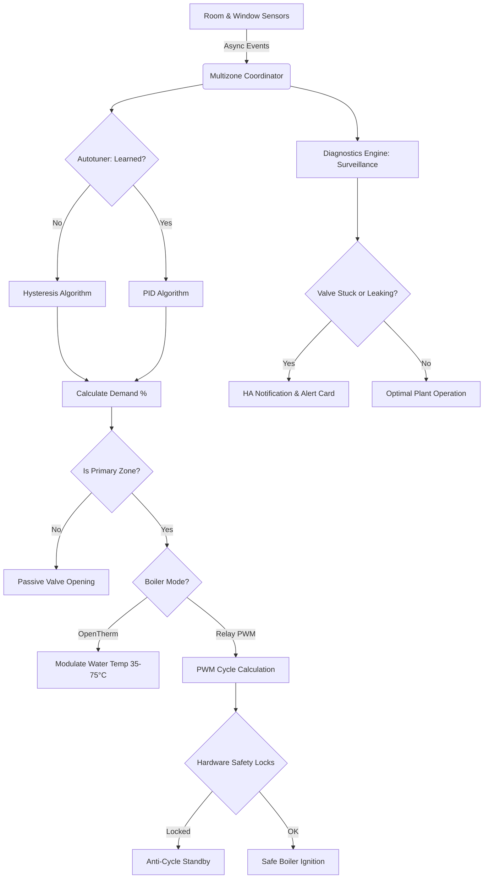

# Multizone Thermostat — Home Assistant Custom Integration

A comprehensive custom integration for Home Assistant that provides **multi-zone heating management**, **centralized boiler supervision**, **dual-drive OpenTherm/Relay modulation**, and **building energy diagnostics**. No YAML automations or scripts required — everything is configured seamlessly through the Home Assistant UI.

---

## 🌟 What Makes This Unique?

1. **Dual Boiler Drive (Relay PWM & OpenTherm Modulating)**: Seamlessly operates with traditional ON/OFF relay boilers via Time-Proportional Integral (PWM) cycles, or with modern OpenTherm modulating gateways by mapping real-time house Heat Demand % (0-100%) to boiler water flow temperature ($35^\circ\text{C} - 75^\circ\text{C}$).
2. **Dynamic Autotuning (Hysteresis → Silent PID)**: Starts in Hysteresis mode, studies each room's thermal dispersion over time, and smoothly transitions to a self-tuned PID controller without user intervention to eliminate temperature swings.
3. **Hierarchical Zones (Primary vs Secondary vs Bypass)**: Primary zones can trigger boiler ignition. Secondary zones only open valves passively to "steal" heat when the boiler is already active, conserving fuel. Bypassed zones exclude rooms completely.
4. **Physical TRV Override & Offset Injection**: The Multizone Coordinator intercepts TRVs attached to hot radiators and injects mathematical offsets or dynamic setpoints to force the valve to obey a clean, external room temperature sensor.
5. **Hydraulic Anomaly Surveillance Engine**: Continuously monitors each heating circuit for mechanical faults, detecting stuck closed valves, ghost heating leakage, and sensor lag, issuing native Home Assistant persistent notifications.
6. **Building Energy & Thermal Retention Metrics**: Automatically estimates each room's theoretical European energy class (A4 through G), thermal retention time (hours required to drop 1°C), and radiator power sizing.
7. **100% Async Event-Driven**: Zero polling loops. The coordinator only wakes up on state changes, ensuring near-zero CPU footprint on your Home Assistant server.
8. **Zero-Code Auto Dashboards & Diagnostic Strategies**: Includes 6 custom glassmorphic Lovelace cards and 2 auto-layout dashboard strategies (Thermostats and Diagnostics) with full multilingual localization (**English**, **Italian**, **Russian**).

---

## ⚡ Complete Feature Matrix

### Core Climate & Zone Management
- 🖥️ **100% UI Config Flow & Reconfiguration Wizard**: Select your boiler mode, add zones, configure actuators and sensors directly from the HA interface without YAML.
- 🔘 **Master Switch**: One central switch to enable or disable the entire heating system with safe shutdown.
- 🏠 **Hierarchical Zone Modes**: Per-zone selector (`Primary`, `Secondary`, `Bypass`) accessible directly from Lovelace cards.
- 📍 **Geofencing & Dynamic Presence**: Automatically switches to Away or Sleep presets based on home occupancy sensors.
- 🪟 **Window Sensor Detection**: Automatically bypasses a zone when a window is opened, and restores it when closed.
- 🌡️ **Virtual Thermostats**: Combine any simple heater switch (relay, underfloor actuator) and temperature sensor into a fully featured PID climate entity.
- 🧠 **Multi-TRV Aggregation**: Group multiple TRVs in the same room; the system automatically calculates their average temperature and syncs their targets.
- 🔄 **Global Presets & Dynamic Memory**: Manual, Eco, Comfort, Sleep, Away. The system remembers the specific target temperature and bypass state of *each zone* per preset.
- 📅 **Global Calendar Integration & Predictive Smart Start**: Schedules presets via Home Assistant's native Local Calendar and preheats rooms ahead of time based on learned thermal retention models.
- 🌤️ **Adaptive Weather Compensation**: Dynamic Feed-Forward heating adjustment based on an outdoor temperature sensor. The system automatically learns each room's thermal dispersion to adapt the compensation curve.

### Hardware Protection & Safety
- 🛡️ **Anti-Short-Cycle Engine**: Configurable minimum ON and minimum OFF times to prevent rapid boiler cycling and extend burner relay lifespan.
- ⏱️ **Valve Opening Delay**: Configurable delay to ensure thermoelectric actuators have fully opened before igniting the boiler.
- ❄️ **Anti-Frost Protection Override (v4.3)**: Global safety override with dedicated switch (`switch.multizone_thermostat_anti_frost_protection`) and threshold control (`number.frost_protection_temp`). Forces emergency heating at 100% demand when room temperature drops below frost threshold, ignoring open window and master off blocks to prevent frozen pipes.
- ☀️ **Summer Anti-Seize Protection**: Cyclical exercise of boiler pumps and zone valves during idle summer months to prevent mechanical seizure.
- 🔄 **Bidirectional Physical Climate Sync (v4.3)**: Dynamic toggle switches allowing physical hardware buttons on TRVs to propagate setpoint adjustments to the virtual zone without fighting, with parental lock capability.

### Plant Diagnostics & Building Efficiency (v4.5+)
- 🔍 **Central Plant Health Monitoring**: Real-time tracking of boiler ignition frequency (cycles/hour), cumulative 24h runtime, and real-time state reasons.
- 🚨 **Mechanical Anomaly Detection**: Automatic detection of stuck valves (heat demanded for >45m but room temperature drops) and ghost heating leakage (room temperature rises while valve is closed).
- ♨️ **Apporto Termico Passivo (Passive Heat Intake)**: Switchable per zone (`allow_passive_heat`), tailored for open lofts, mezzanines, or fan coils without cutoff valves to prevent false ghost-heating alerts.
- 📊 **European Building Energy Classes (A4 → G)**: Theoretical energy grade calculated from thermal dispersion and outdoor weather $\Delta T$.
- ⏱️ **Thermal Retention Time**: Displays estimated hours needed for each room to lose $1.0^\circ\text{C}$.
- 📐 **Radiator Sizing Evaluation**: Identifies whether the heating emitter is optimal, undersized, or oversized for the space.
- 🩺 **HA Native Diagnostics & Trace Engine (v4.4)**: Downloadable JSON diagnostics directly from Home Assistant's device settings.

---

## 🎨 Custom Lovelace Cards & Strategies

Multizone Thermostat includes **6 custom Lovelace cards** and **2 auto-dashboard strategies**, automatically registered in Home Assistant:

| Card / Strategy | Lovelace Type | Zero-Config? | Description |
| :--- | :--- | :---: | :--- |
| **Central Plant Health Card** | `custom:multizone-thermostat-plant-card` | ✅ Yes | Real-time burner telemetry, short-cycle ignition frequency, and active hydraulic anomalies list. |
| **Zone Energy Efficiency Card** | `custom:multizone-thermostat-zone-energy-card` | Configurable | Theoretical European Energy Class (A4-G), thermal retention time (-1°C), radiator sizing, and valve surveillance. |
| **Central Heating Status Card** | `custom:multizone-thermostat-status-card` | ✅ Yes | Button-style master card displaying system state (Grey: Off, Yellow: Standby, Orange: Active Heating). |
| **Dial Thermostat Card** | `custom:multizone-thermostat-dial-card` | Configurable | Circular thermostat card with integrated Primary/Secondary/Bypass selector. |
| **Button Thermostat Card** | `custom:multizone-thermostat-button-card` | Configurable | Compact card with `+` / `-` controls, HVAC modes, and zone mode selector. |
| **Global Preset Card** | `custom:multizone-thermostat-preset-card` | ✅ Yes | Multi-preset bar (Manual, Eco, Comfort, Sleep, Away) with dynamic memory. |
| **Auto Thermostats View Strategy** | `custom:multizone-thermostat-dashboard` | Strategy | Auto-generates a complete responsive climate dashboard with presets, master switch, and zone cards. |
| **Auto Diagnostics View Strategy** | `custom:multizone-thermostat-diagnostics` | Strategy | Auto-generates a full diagnostic view with plant health supervisor and energy efficiency cards for all zones. |

> [!NOTE]
> All Lovelace cards automatically adapt to the user's Home Assistant language setting (**English**, **Italian**, and **Russian** supported natively).

---

## 🔥 OpenTherm Hybrid Support

Multizone Thermostat features a **dual-drive architecture** allowing seamless operation with both traditional relay boilers and modern modulating OpenTherm gateways:

- **Relay Mode (ON/OFF PWM)**: Uses Time-Proportional Integral (PWM) duty cycles to switch the boiler relay based on the calculated Heat Demand %, strictly respecting anti-short-cycle rules.
- **OpenTherm Mode (Modulating)**: Directly modulates the boiler water flow temperature according to real-time house demand.

### Heat Demand Mapping (0-100% to Water Temperature)

In OpenTherm mode, the coordinator translates the house's total calculated **Heat Demand %** ($0\%$ to $100\%$) into a precise target setpoint for boiler water flow temperature, mapped linearly between configured Minimum Water Temperature ($T_{\text{min}}$, e.g. 35°C) and Maximum Water Temperature ($T_{\text{max}}$, e.g. 75°C):

$$\text{Water Temperature} = T_{\text{min}} + \left( \frac{\text{Demand \%}}{100} \times (T_{\text{max}} - T_{\text{min}}) \right)$$

**Practical Example (35°C Min / 75°C Max):**
- **0% Demand**: Central heating request deactivated or set to minimum standby ($35^\circ\text{C}$).
- **50% Demand**: Target water flow temperature set to $55^\circ\text{C}$.
- **100% Demand**: Target water flow temperature set to maximum output ($75^\circ\text{C}$).

The calculated water temperature is sent directly to your OpenTherm Gateway climate or number entity, allowing the boiler's internal modulation logic to adjust flame height efficiently.

---

## 🏗️ System Architecture

---

## 🎮 Interactive Live Simulator & Diagnostics Showcase

Experience the diagnostic supervision and building energy calculation features directly inside your browser. Multizone Thermostat provides a standalone web simulator running the exact same frontend algorithms as the Home Assistant Lovelace cards:

- **Live Web App**: [https://alex-military.github.io/multizone-thermostat/](https://alex-military.github.io/multizone-thermostat/)
- **Offline / Local**: Open [`examples/diagnostics_demo.html`](examples/diagnostics_demo.html) directly in any browser.
- **Multilingual Support**: Instant toggle between 🇬🇧 English, 🇮🇹 Italian, and 🇷🇺 Russian.

> [!TIP]
> The live simulator is hosted directly on this repository via **GitHub Pages** (`docs/index.html`).
> *To enable GitHub Pages on your fork*: Navigate to **Settings** → **Pages** → under **Build and deployment**, set Source to **Deploy from a branch**, Branch to `master` and folder to `/docs`.

### 🔍 Interactive Scenario Showcase

Explore how the central plant supervision and zone energy evaluation react to real-world thermal situations:

<b>1. 🟢 Normal Operation (Optimal Plant Health)</b>

 

| Metric | Central Plant | Living Room (Primary) | Master Bedroom (Primary) |
| :--- | :--- | :--- | :--- |
| **System State** | **OPTIMAL** (Burner Standby) | Target: 20.5°C / Current: 20.4°C | Target: 20.0°C / Current: 21.1°C |
| **Boiler Cycles** | **1.8 cycles/h** (Low Wear) | — | — |
| **Runtime 24h** | **4.2 hours** | — | — |
| **Energy Class** | — | **Class A (3.2 kW/m²)** | **Class C (5.2 kW/m²)** |
| **Thermal Retention** | — | **7.8 hours** (-1°C) • *Great Insulation* | **3.8 hours** (-1°C) • *Average Insulation* |
| **Radiator Sizing** | — | **Optimal** (Power/loss ratio OK) | **Oversized** (High power output) |
| **Valve Status** | Circuits operational | ✅ Valve Closed (Target met) | ✅ Valve Closed (Target met) |

<b>2. 🟡 High Short-Cycling Alert (Boiler Stress)</b>

 

| Metric | Central Plant | Root Cause & Mitigation |
| :--- | :--- | :--- |
| **System State** | **ATTENTION** (High Ignition Frequency) | Burner cycling frequently due to low heat capacity or undersized minimum off-time. |
| **Boiler Cycles** | **⚠️ 5.8 cycles/h (> 5.0 c/h)** | *Exceeds safe mechanical limit.* |
| **Runtime 24h** | **5.4 hours** | Fragmented bursts reduce condensation efficiency and strain relay contacts. |
| **System Guidance** | Increase minimum off-time in options | Increase `min_cycle_off` parameter in integration settings to bundle heating demands into fewer, longer cycles. |

<b>3. 🔴 Critical Anomaly: Stuck Mechanical Valve</b>

 

| Metric | Room Details | Automated Diagnosis |
| :--- | :--- | :--- |
| **Zone** | **Master Bedroom** (Primary) | Heat demanded for > 45 minutes with boiler running, but room temperature continues dropping. |
| **Energy Class** | **Class F** (Severe Dispersion) | Room losing heat faster than emitter output. |
| **Thermal Retention** | **2.1 hours** (-1°C) • *Rapid dispersion* | Cold wall transmission or open damper. |
| **Valve Surveillance** | **❌ CRITICAL: Valve Stuck Closed** | **Hardware Fault:** Actuator pin stuck closed or air trapped in radiator. Persistent notification dispatched to Home Assistant notifications center. |

<b>4. 🟣 Mezzanine & Fan Coil: Passive Heat Intake (Apporto Passivo)</b>

 

| Metric | Guest Bedroom / Mezzanine (Bypassed Zone) | Thermal Behavior |
| :--- | :--- | :--- |
| **Zone Mode** | **BYPASSED / SECONDARY** | Zone excluded from triggering central boiler ignition. |
| **Passive Intake** | **Active (Apporto Passivo)** | Designed for open mezzanines or fan coils without cutoff valves where hot water circulates freely. |
| **Valve Surveillance** | **Valve Closed (Passive heat active)** | Suppresses false "ghost heating" alarms when convective heat rises from the floor below. |

---

## Installation

### Via HACS (Recommended)

1. Open HACS in your Home Assistant instance.
2. Click the three dots in the top right corner and select **Custom repositories**.
3. Add `https://github.com/alex-military/multizone-thermostat` as an **Integration**.
4. Search for **"Multizone Thermostat"** in HACS and click **Download**.
5. Restart Home Assistant.

### Manual Installation
1. Copy the `custom_components/multizone_thermostat` folder to your Home Assistant `custom_components` directory.
2. Restart Home Assistant.

---

## Documentation Hub

Explore our dedicated documentation pages for deep dives:

- ⚙️ **[Configuration & Setup Guide](configuration.md)**: Hardware aggregation, setup wizard, virtual thermostats, geofencing, calendar scheduling, anti-frost, and summer protection.
- 🎨 **[Lovelace Custom Cards & Dashboard](cards.md)**: Detailed configuration, YAML examples, and strategies for all 6 custom cards.
- 🚀 **[Project Roadmap](ROADMAP.md)**: Development phases, completed milestones, and future features.

---

## Acknowledgments

A special thanks to the creators of [SmartThermostat](https://github.com/ScratMan/HASmartThermostat) and [vindaalex/multizone-thermostat](https://github.com/vindaalex/multizone-thermostat). The core mathematical logic for the PID controller and the Autotuning algorithm in this project were deeply inspired by and adapted from their fantastic open-source work.

## License

This project is licensed under the MIT License.
