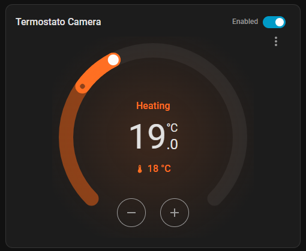
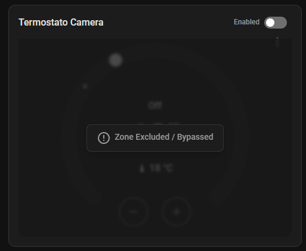
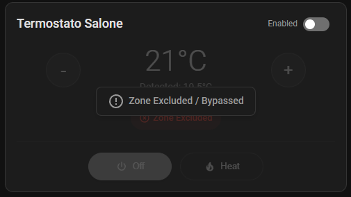

# Multizone Thermostat — Home Assistant Custom Integration

A custom integration for Home Assistant that provides **multi-zone heating management** with **centralized boiler control**. No YAML scripting or manual automations required — everything is configured through the HA UI.

## Features

- 🖥️ **UI Config Flow** — Select your boiler relay and climate entities directly from the HA interface
- 🔘 **Master Switch** — One switch to enable/disable the entire heating system
- 🏠 **Per-Zone Switches** — Individual switches for each room/zone, persistent across restarts
- 🔥 **Automatic Boiler Control** — Boiler turns ON when any zone is heating, OFF when all zones are idle
- 🌡️ **TRV Preset Sync** — Optional per-zone preset synchronization for physical TRV valves
- ⚙️ **Options Flow** — Add/remove zones and change settings after installation

## Installation

### Via HACS (recommended)
1. Add this repository as a custom repository in HACS
2. Install "Multizone Thermostat"
3. Restart Home Assistant

### Manual
1. Copy the `custom_components/multizone_thermostat` folder to your HA `custom_components` directory
2. Restart Home Assistant

## Configuration

1. Go to **Settings → Devices & Services → Add Integration**
2. Search for **"Multizone Thermostat"**
3. Follow the setup wizard:
   - **Step 1**: Select your boiler switch/relay entity
   - **Step 2**: Add heating zones (climate entity + zone name)
   - **Step 3**: Confirm and finish

## Entities Created

| Entity | Description |
|--------|-------------|
| `switch.multizone_master` | Master on/off for the entire heating system |
| `switch.multizone_[zone_name]` | Per-zone on/off switch (one per configured zone) |
| `number.multizone_min_cycle_on` | Minimum boiler ON time (minutes) |
| `number.multizone_min_cycle_off` | Minimum boiler OFF time (minutes) |
| `number.multizone_valve_delay` | Valve opening delay before boiler starts (seconds) |

## How It Works

```
Master Switch ON
    └── Zone Switch ON  → climate.set_hvac_mode(heat)
    └── Zone Switch OFF → climate.set_hvac_mode(off)

Master Switch OFF
    └── ALL zones → climate.set_hvac_mode(off)
    └── Boiler   → switch.turn_off()

Any zone hvac_action = heating → Boiler ON
All zones hvac_action = idle/off → Boiler OFF
```

## Options (Post-Installation)

Go to **Settings → Devices & Services → Multizone Thermostat → Configure** to:
- Change the boiler switch
- Add a new zone
- Remove an existing zone
- Enable/disable TRV preset sync per zone

## TRV Preset Sync

When enabled for a zone, the integration automatically syncs the TRV preset mode:
- HVAC mode `heat` → preset `manual`
- HVAC mode `off` → preset `off`

Only enable this for zones with physical TRV valves that support preset modes.

## Lovelace Cards

This integration includes three beautiful custom Lovelace cards to control your heating zones and view the central heating status directly in your Home Assistant dashboards.

### 1. Central Heating Status Card (`custom:multizone-thermostat-status-card`)
A zero-configuration, button-style card that displays the status of the central heating master switch. It changes color and icon dynamically depending on the state of the Master Switch and the Boiler/Circulator:
- **Grey (Off)**: The master heating system is disabled.
- **Yellow (Standby)**: The master heating system is enabled, but no zone is currently calling for heat (boiler is idle).
- **Orange (Heating)**: The master heating system is enabled, and at least one zone is calling for heat (boiler is active).

#### States
| Off | Standby (Idle) | Active Heating |
|---|---|---|
|  |  |  |

---

### 2. Dial Thermostat Card (`custom:multizone-thermostat-dial-card`)
Wraps the native Home Assistant circular thermostat card and adds a built-in toggle switch to easily enable or exclude (bypass) the zone.
- **Enabled**: Displays the interactive dial to adjust temperature.
- **Disabled**: Dims the dial and overlays a clean "Zone Excluded / Bypassed" message.

#### States
| Enabled | Excluded (Bypassed) |
|---|---|
|  |  |

---

### 3. Button Thermostat Card (`custom:multizone-thermostat-button-card`)
A compact button-based thermostat card designed for spaces where a circular dial is too large. It includes temperature controls (`+` / `-`), current and target temperature displays, HVAC mode selectors, and the zone enable/exclude switch.
- **Enabled**: Fully interactive controls.
- **Disabled**: Dims the controls and displays a "Zone Excluded / Bypassed" overlay.

#### States
| Enabled | Excluded (Bypassed) |
|---|---|
|  |  |

---

### Card Installation

To use these cards, make sure you add the JavaScript resource to your Lovelace dashboard configuration:
1. Go to **Settings → Dashboards**.
2. Click the three dots in the top right and select **Resources**.
3. Add a new resource:
   - **URL**: `/local/multizone-thermostat-card.js`
   - **Resource type**: `JavaScript Module`
4. Refresh your browser page.

### Configurations

#### Status Card (Zero-Config)
The status card requires zero configuration because it automatically detects your Master Switch:
```yaml
type: custom:multizone-thermostat-status-card
```

#### Dial Thermostat Card
```yaml
type: custom:multizone-thermostat-dial-card
entity: climate.living_room         # Your climate entity
switch: switch.multizone_living_room # (Optional) The bypass switch for this zone
title: Living Room                  # (Optional) Custom title
```

#### Button Thermostat Card
```yaml
type: custom:multizone-thermostat-button-card
entity: climate.living_room         # Your climate entity
switch: switch.multizone_living_room # (Optional) The bypass switch for this zone
title: Living Room                  # (Optional) Custom title
```

## Requirements

- Home Assistant 2023.x or newer
- At least one `climate` entity (thermostat/TRV)
- At least one `switch` entity (boiler relay)

## Future Roadmap

The project is structured in phases to evolve from a simple aggregator to a full-fledged smart climate manager.

### FASE 1 — Sicurezza Impianto (Current Focus)
- [x] **Antipendolamento (`min_cycle_duration`)**: Previene oscillazioni rapide della caldaia con tempi minimi di ON/OFF (implementato via entità `number`).
- [x] **Ritardo Accensione Caldaia (`valve_opening_delay`)**: Ritardo in secondi per permettere l'apertura delle valvole termoelettriche (implementato via entità `number`).
- [x] **Rilevamento Finestra Aperta — `window_sensor`**
  - **Problema**: Apertura finestra → calo temperatura → termostato accende caldaia → spreco energetico.
  - **Soluzione**: Selezione opzionale di un `binary_sensor` per ogni zona nel Config Flow.
    - Sensore `on` (finestra aperta) → zona bypassata automaticamente.
    - Sensore `off` (finestra chiusa) → zona ripristina lo stato precedente al bypass.
  - **UI**: Entity picker per `binary_sensor` nel wizard di configurazione zona e nelle Opzioni.
  - **Memoria stato**: Stato precedente salvato nello storage persistente (`.storage/`) per resistere ai riavvii di HA.
  - **Stato**: ✅ Implementato

### FASE 2 — Evoluzione Architetturale
- [ ] **Termostati Virtuali via UI**: Creazione automatica di entità `climate` da un sensore di temperatura e uno switch (es. fancoil/relè sfusi) senza YAML.
- [ ] **Preset Globali (Memoria Temperature e Bypass)**: I preset (Eco / Comfort / Sleep / Away) fungono da "scenari globali" con memoria dinamica per singola zona. 
  - Selezionando un preset, il sistema applicherà le impostazioni salvate per ogni zona.
  - Se modifichi la temperatura o attivi/disattivi il bypass di una zona mentre è attivo un preset, il sistema *ricorda* quella modifica e la salverà permanentemente per quel preset.
  - Al successivo utilizzo dello stesso preset, la zona tornerà esattamente allo stato (temperatura target e stato bypass) configurato l'ultima volta.
- [ ] **Geofencing Zero-Code**: Cambio preset automatico in base alla presenza (Away/Comfort).

### FASE 3 — Ottimizzazione Energetica Avanzata
- [ ] **Algoritmo PWM/PID Selezionabile**: Modulazione del tempo di accensione per impianti modulanti.
- [ ] **Carico Richiesto Globale (%)**: Sensore percentuale del fabbisogno termico per pompe di calore.
- [ ] **Curva Climatica Integrata**: Ottimizzazione temperatura di mandata basata sul meteo esterno.
- [ ] **Antigrippaggio Estivo**: Attivazione periodica delle valvole in estate per prevenire blocchi.
