# Multizone Thermostat Custom Lovelace Cards

[⬅️ Back to Main Readme](README.md)

This integration includes three custom Lovelace cards to control your heating zones and view the central heating status directly in your Home Assistant dashboards. The cards are **auto-registered** — no manual resource configuration needed.

## 1. Central Heating Status Card (`custom:multizone-thermostat-status-card`)
A zero-configuration, button-style card that displays the status of the central heating master switch. It changes color and icon dynamically depending on the state of the Master Switch and the Boiler/Circulator:
- **Grey (Off)**: The master heating system is disabled.
- **Yellow (Standby)**: The master heating system is enabled, but no zone is currently calling for heat (boiler is idle).
- **Orange (Heating)**: The master heating system is enabled, and at least one zone is calling for heat (boiler is active).

### States
| Off | Standby (Idle) | Active Heating |
|---|---|---|
| 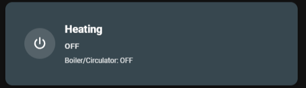 | 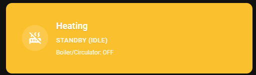 | 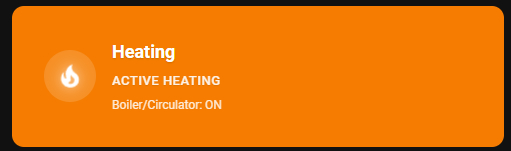 |

---

## 2. Dial Thermostat Card (`custom:multizone-thermostat-dial-card`)
Wraps the native Home Assistant circular thermostat card and adds a built-in selector to easily set the zone to Primary, Secondary, or Bypass.
- **Primary**: Zone is fully active and can trigger the boiler.
- **Secondary**: Zone opens its valves to receive heat when the boiler is running, but cannot trigger the boiler by itself.
- **Bypassed**: Dims the dial, disables temperature controls, and displays a clean "Zone Excluded / Bypassed" message.

### States
| Primary (Idle) | Secondary (Idle) | Bypassed | Active Heating |
|---|---|---|---|
| 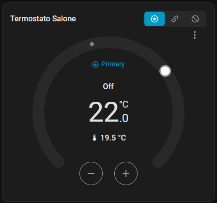 | 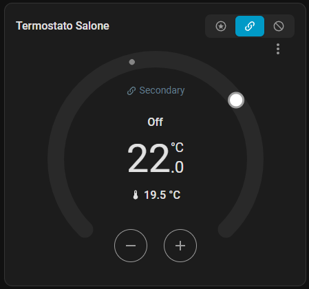 | 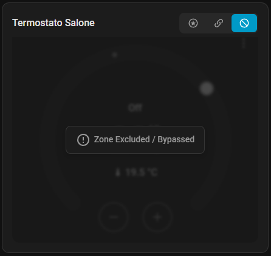 | 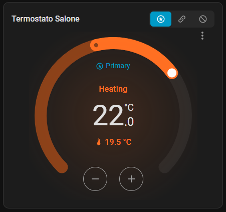 |

---

## 3. Button Thermostat Card (`custom:multizone-thermostat-button-card`)
A compact button-based thermostat card designed for spaces where a circular dial is too large. It includes temperature controls (`+` / `-`), current and target temperature displays, HVAC mode selectors, and the Zone Mode selector.
- **Active**: Fully interactive controls with dynamic orange halo when heating.
- **Bypassed**: Dims the controls and displays a "Zone Excluded / Bypassed" overlay.

### States
| Primary (Idle) | Secondary (Idle) | Bypassed | Active Heating |
|---|---|---|---|
| 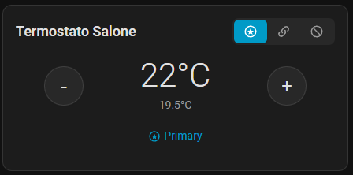 | 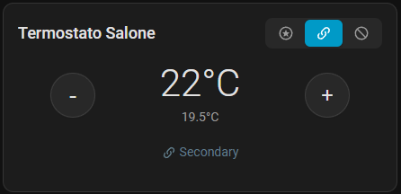 | 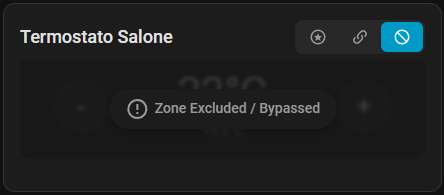 | 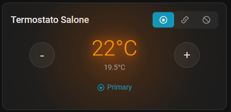 |

---

## 4. Global Preset Card (`custom:multizone-thermostat-preset-card`)
A zero-configuration, multi-button card designed for quick selection of the global heating preset (Manual, Eco, Comfort, Sleep, Away). 
- **Auto-Discovery**: Automatically finds and binds to the `select.multizone_thermostat_global_preset` entity without any configuration.
- **Dynamic Styling**: The active preset is dynamically highlighted using your current Home Assistant theme colors.
- **Smart Memory**: Changing the preset instantly recalls the exact temperatures and zone modes (Primary/Secondary/Bypass) you had previously set for that specific preset.

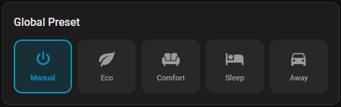

---

## Card Configuration

### Status Card (Zero-Config)
The status card requires zero configuration because it automatically detects your Master Switch:
```yaml
type: custom:multizone-thermostat-status-card
```

### Dial Thermostat Card
```yaml
type: custom:multizone-thermostat-dial-card
entity: climate.your_climate_entity           # Your climate entity (copy ID from HA UI)
title: Living Room                            # (Optional) Custom title
```

### Button Thermostat Card
```yaml
type: custom:multizone-thermostat-button-card
entity: climate.your_climate_entity           # Your climate entity (copy ID from HA UI)
title: Living Room                            # (Optional) Custom title
```

### Global Preset Card (Zero-Config)
The preset card automatically finds your global preset entity. You can optionally override it or set a custom title.
```yaml
type: custom:multizone-thermostat-preset-card
# title: "My Presets"                           # (Optional) Custom title
# entity: select.multizone_thermostat_global_preset # (Optional) Override auto-discovery
```

> **Tip**: To find your exact entity IDs, go to **Settings → Devices & Services → Multizone Thermostat** and click on any entity. The entity ID is shown at the bottom of the entity page.

---

## 5. Auto-Generated Dashboard Strategy (`custom:multizone-thermostat-dashboard`)
If you want a complete, ready-to-use dashboard without writing any YAML for individual cards, you can use the built-in Dashboard Strategy. This strategy automatically discovers all your heating zones, virtual thermostats, presets, and the master switch, generating a beautifully structured layout instantly.

### Features
- **Zero Configuration**: Automatically finds and connects all your entities.
- **Dynamic Grid**: Automatically calculates rows and columns based on your preference.
- **Clean Titles**: Automatically strips out the technical "Virtual Thermostats VT" prefix from your zones.
- **Native Styling**: Smooth rounded corners and perfectly sized cards without needing external plugins like `card-mod`.

### How to use
You can add it as a new View in your existing dashboard. Open the Raw Configuration Editor and add this under `views:`:

```yaml
views:
  - title: Clima
    path: clima
    icon: mdi:thermostat
    panel: true    # Recommended: Sets the view to full-width for the best layout
    strategy:
      type: custom:multizone-thermostat-dashboard
      columns: 3   # Optional: Set the number of columns (default is 3)
```

### Layout Customization
You can customize the number of columns to perfectly fit your device screen (e.g., tablet vs phone) simply by changing the `columns` parameter.

#### 2 Columns Layout (`columns: 2`)
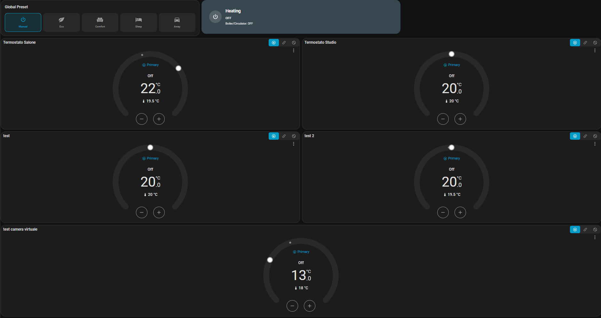

#### 3 Columns Layout (`columns: 3`)
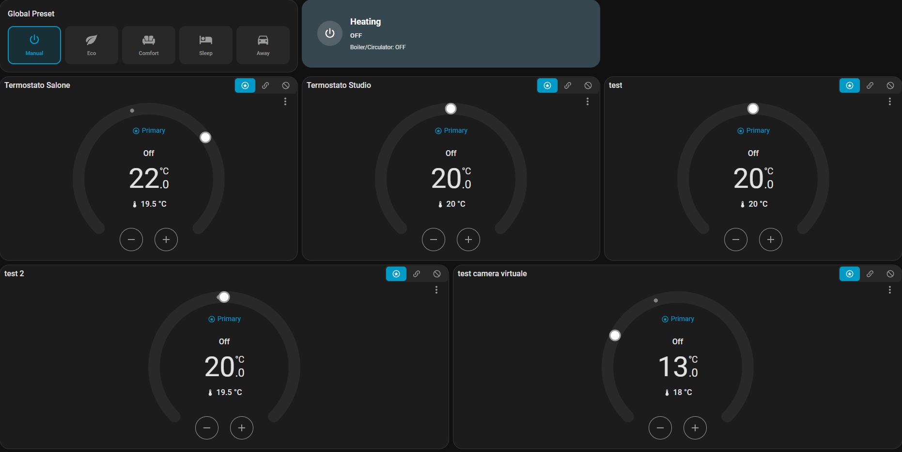

#### 4 Columns Layout (`columns: 4`)
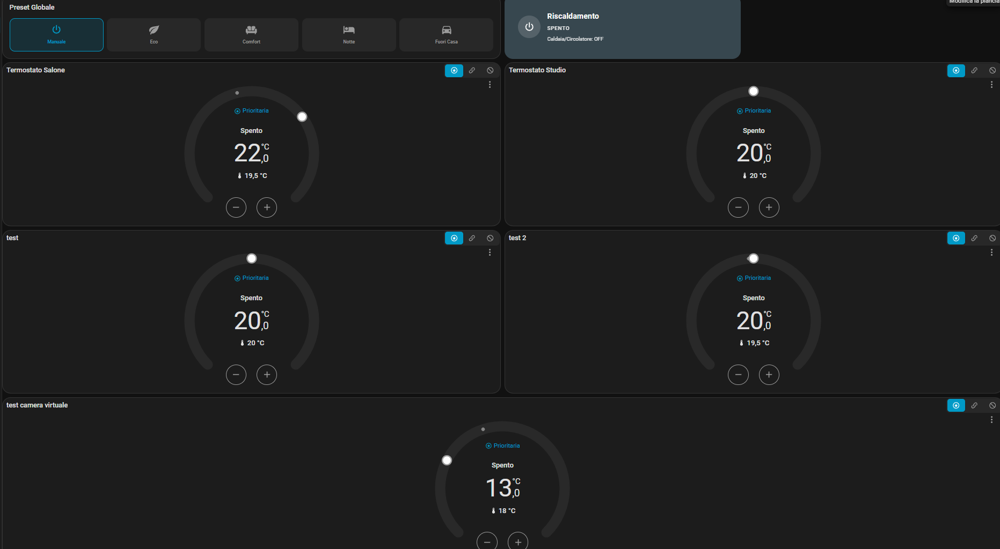

> **Note**: If you installed via HACS, the Lovelace card resource is registered automatically. If cards don't appear, add the resource manually:
> Go to **Settings → Dashboards → Resources** → Add `/multizone_thermostat_card/multizone-thermostat-card.js` as **JavaScript Module**.
